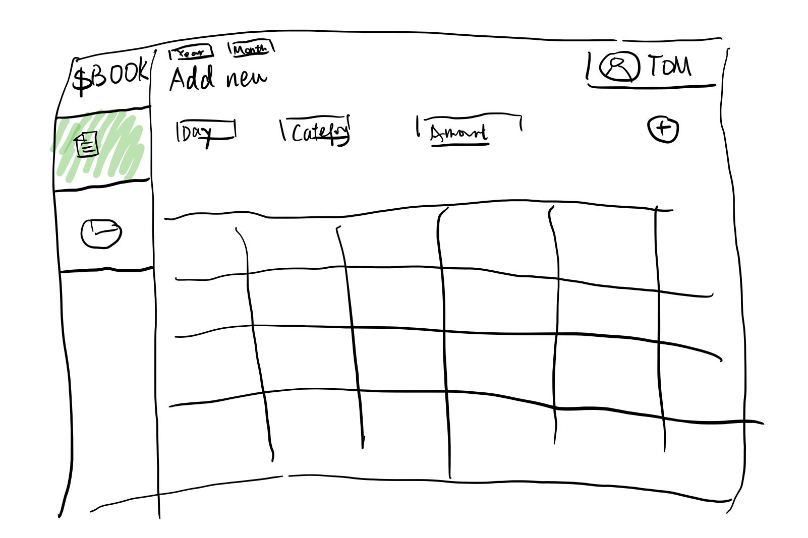

# $BOOK

## Overview

With apple pay, credit cards, and paypal, many people spend wayyyyy more money than their realization because money are reduced from electronic pocket are not like cash removed from wallet which can be seen directly. Then, people need a place to record where they spend their money on and how much they spend on it. That's why we need `$BOOK`!

`$BOOK` is a web app that will allow users to keep track of their daily spendings. User can register and login. After they login, they can see their records before and start the new record. They can also see the analysis of their spending habits which can help them better manage their money.

## Data Model

The application will store User, Year, Month, and Transaction

- users can have multiple years for their records. (via reference)
- each list can have multiple items. (by embedding)

An Example User

```javascript
{
  username: "Tom",
  hash: // a password hash,
  years: // an array of references to Year documents
}
```

An Example Year
```javascript
{
  months: // an array of references to Month documents
}
```

An Example Month
```javascript
{
  transactions: // an array of references to this month's transaction documents
}
```

An Example Transaction with Embedded Items:

```javascript
{
	user: // a reference to a User object
	month: "January",
    year: "2022",
	items: [
		{ Day: "1", flow: "out", Amount: 2.75 Category: "Transportaion", comment: "NYC subway to meet my friend!"},
        { Day: "31", flow: "in", Amount: 200 Category: "Salary", comment: ""},
    ],
}
```

## Link to Commented First Draft Schema
[click here to see my schema](/schema_draft.mjs)


## Wireframes

/home - page users see after login


/record - page for recording transactions




/analysis - page for users to see analysis of their spending


## Site map

`/record` - after add/delete transaction, it will go to itself to refresh the page

`/analysis` - the data analysis page uses comes from the data users add into the `/record` page

## User Stories

1. as non-registered user, I can register a new account with the site

2. as a user, I can log in to the site

3. as a user, I can add transaction to current month list

4. as a user, I can delete transaction from current month list

5. as a user, I can transfer into past month list.

6. as a user, I can view all the transactions I added in the the current selected month list

   

## Research Topics

- (`5 points`) Integrate user authentication
  - I'm going to be using email for verification
  - You can use your email to do the registration, and then you can have your account to login to test.
  - I think it's not easy to do that so I give it `5 points`.
- (`5 points`) React.js
  - used React.js as the frontend framework;  it's a challenging library to learn, so I've assigned it `5 points`

## Link to Initial Main Project File
[click here to my app.mjs](/app.mjs)

## Annotations/References Used

1. email registration - https://github.com/U-c0de/Email-Authentication-Registration
2. tutorial on React.js - https://learn.microsoft.com/en-us/windows/dev-environment/javascript/react-beginners-tutorial
